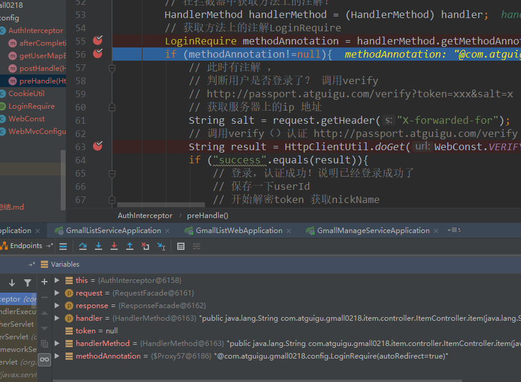
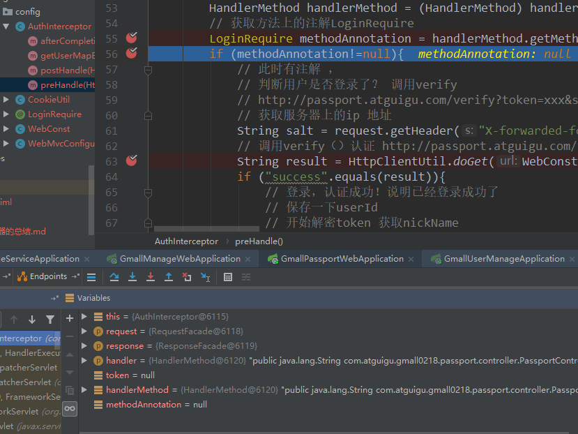
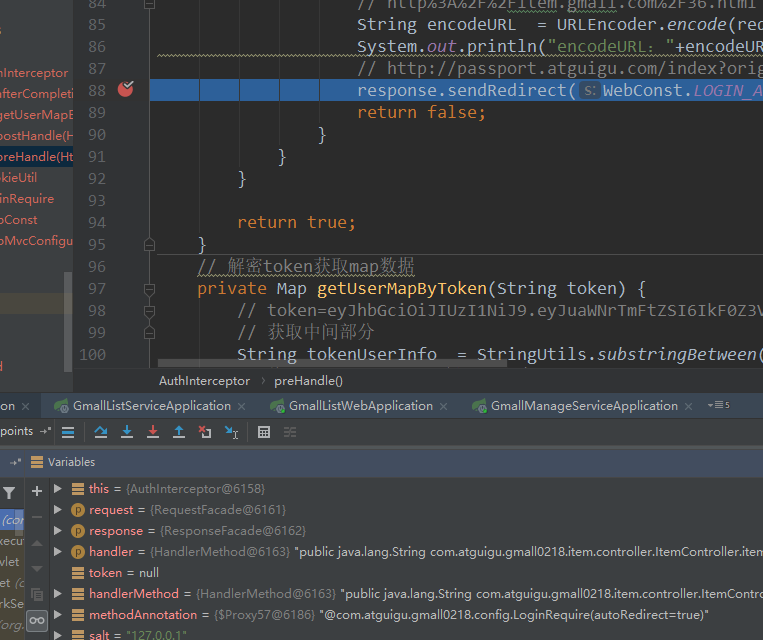
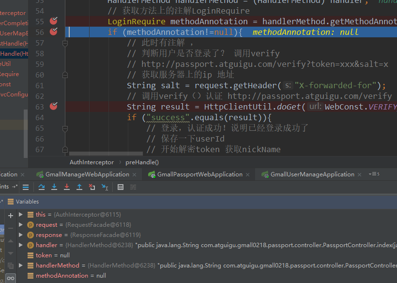
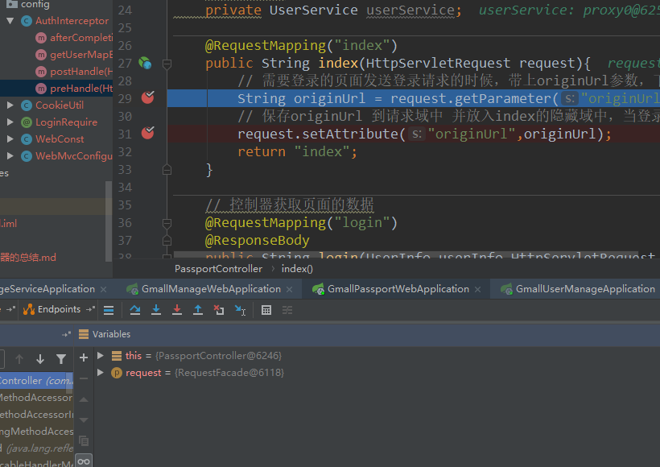
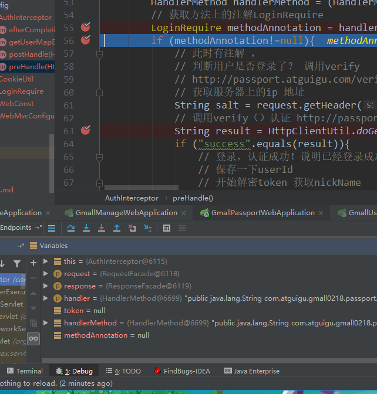
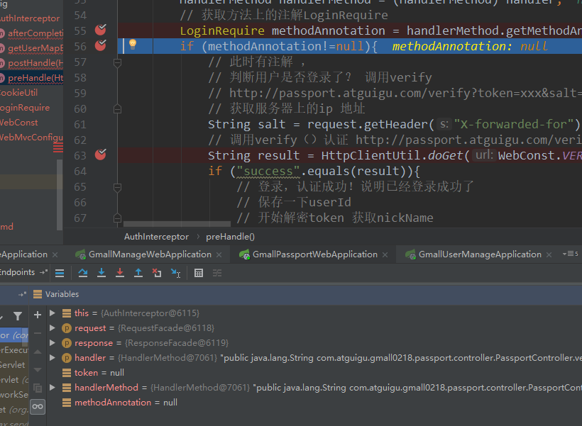
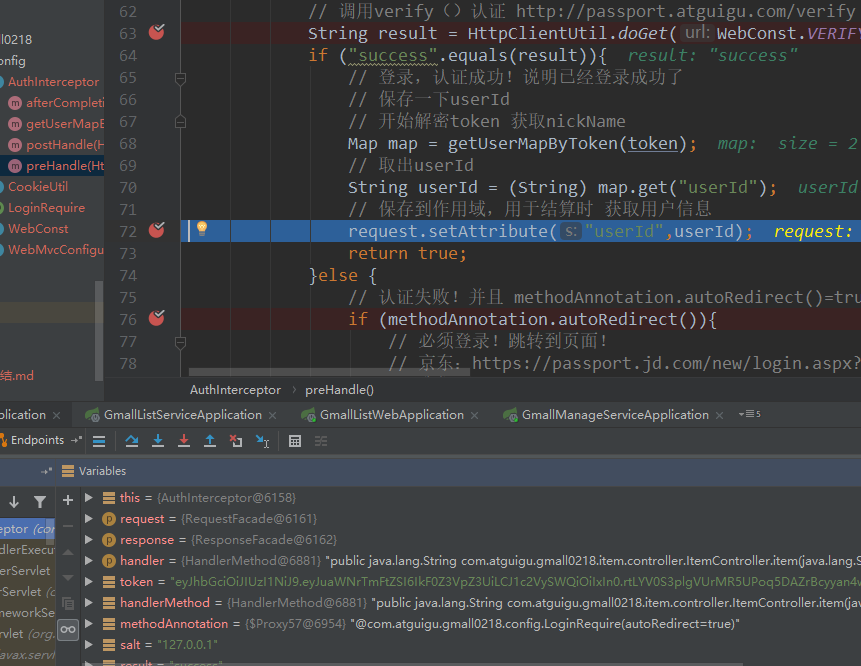

# item请求发送前拦截request：6161，handlerMethod：6163

# verify的拦截，使用doget发送新的请求request：6118，handlerMethod：6120

# 验证失败后的返回，回到6161请求，request：6161，handlerMethod：6163

# 重定向到index登录页面的拦截，转发后新生成一个新的请求request：6118，handlerMethod：6238

# 转发后跳到index方法返回登录界面，同一个请求request 6118

# 输入信息后跳到login方法的拦截，同一个request：6118 handlerMethod：6699

# 登录成功后，前端发送item页面的拦截，回到之前的request：6161 handlerMethod：6881

# verify验证之前的拦截，到验证request：6118 handlerMethod：7061

# 成功验证成功后的请求 request：6161 handlerMethod：6881

